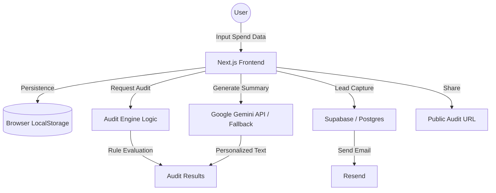

# ARCHITECTURE.md

## System Diagram

## Data Flow
1. **Input**: User enters AI tool usage via a multi-step form.
2. **Persistence**: Data is saved to `localStorage` to persist across reloads.
3. **Audit**: The `AuditEngine` processes the data using hardcoded pricing rules and usage-fit logic.
4. **AI Summary**: Data is sent to an edge function to generate a personalized summary using Google Gemini API.
5. **Storage**: Audit results and lead info are stored in Supabase.
6. **Output**: User receives a detailed report and a unique shareable URL.

## Tech Stack
- **Framework**: Next.js 15 (App Router) for performance and SEO.
- **Language**: TypeScript for type safety and maintainability.
- **Styling**: Tailwind CSS with custom headless UI components (`Button`, `Input`) built from scratch using the shadcn/ui pattern (`cn` utility, `forwardRef`). No shadcn/ui package dependency.
- **Database**: Supabase (Postgres) for easy lead storage and serverless functions.
- **AI**: Google Gemini API (`gemini-2.0-flash`) for personalized audit summaries. Fallback to templated summary if API key is absent.
- **Email**: Resend for transactional emails (sandbox mode — delivery restricted to verified sender address until domain is verified).

## Scalability
If this tool had to handle 10k audits/day:
- Implement robust caching for pricing data.
- Use a message queue (e.g., Upstash QStash) for email delivery to handle spikes.
- Optimize the audit engine to run efficiently on the edge.
- Implement more aggressive rate limiting and abuse protection.

## Abuse Protection
Current implementation uses a **honeypot field** on the lead capture form. A hidden `<input type="text">` field is rendered in the DOM but hidden via CSS. Legitimate users never fill it; bots that auto-fill all fields will populate it. If the honeypot value is non-empty on submission, the request is silently rejected client-side (`if (!email || honeypot) return`).

This approach was chosen over hCaptcha or rate limiting because:
- Zero friction for real users (no CAPTCHA challenge)
- No external dependency or API key required
- Sufficient for MVP-stage abuse protection

For production scale, adding server-side rate limiting (e.g., Upstash Redis) per IP would be the next step.
