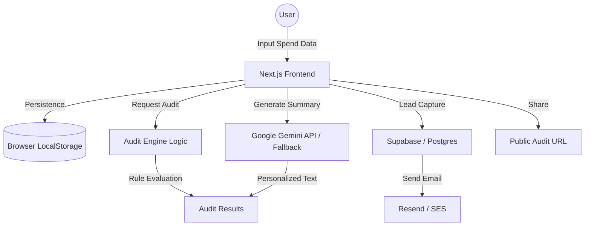

# ARCHITECTURE.md

## System Diagram

## Data Flow
1. **Input**: User enters AI tool usage via a multi-step form.
2. **Persistence**: Data is saved to `localStorage` to persist across reloads.
3. **Audit**: The `AuditEngine` processes the data using hardcoded pricing rules and usage-fit logic.
4. **AI Summary**: Data is sent to an edge function to generate a personalized summary using Claude (Anthropic).
5. **Storage**: Audit results and lead info are stored in Supabase.
6. **Output**: User receives a detailed report and a unique shareable URL.

## Tech Stack
- **Framework**: Next.js 15 (App Router) for performance and SEO.
- **Language**: TypeScript for type safety and maintainability.
- **Styling**: Tailwind CSS + shadcn/ui for rapid, polished UI development.
- **Database**: Supabase (Postgres) for easy lead storage and serverless functions.
- **AI**: Google Gemini API for personalized audit summaries.
- **Email**: Resend for transactional emails.

## Scalability
If this tool had to handle 10k audits/day:
- Implement robust caching for pricing data.
- Use a message queue (e.g., Upstash QStash) for email delivery to handle spikes.
- Optimize the audit engine to run efficiently on the edge.
- Implement more aggressive rate limiting and abuse protection.
